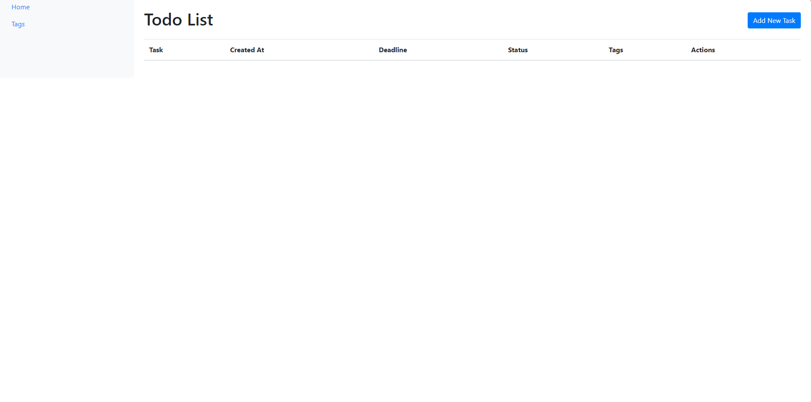
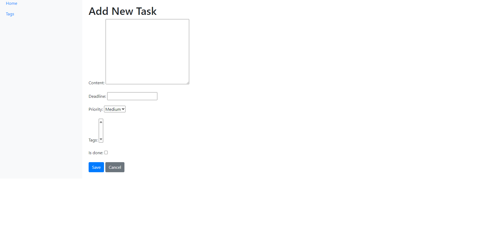
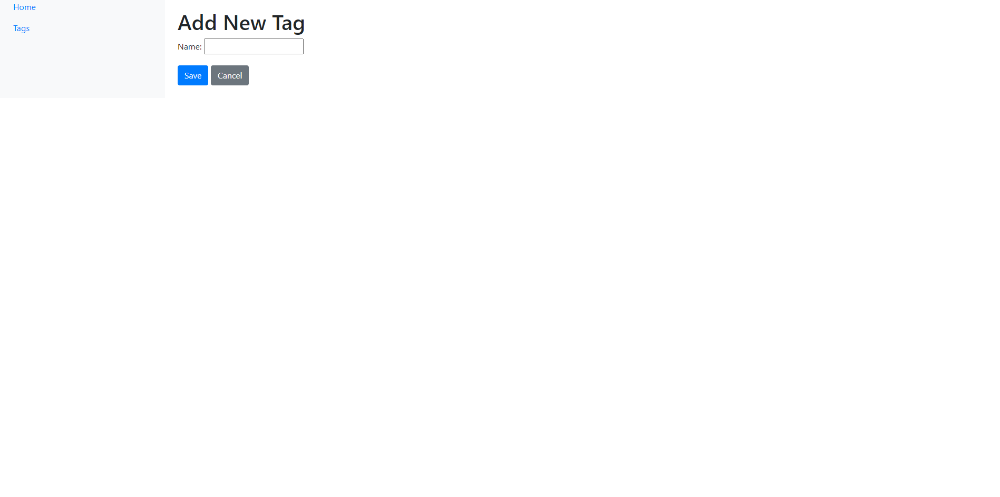
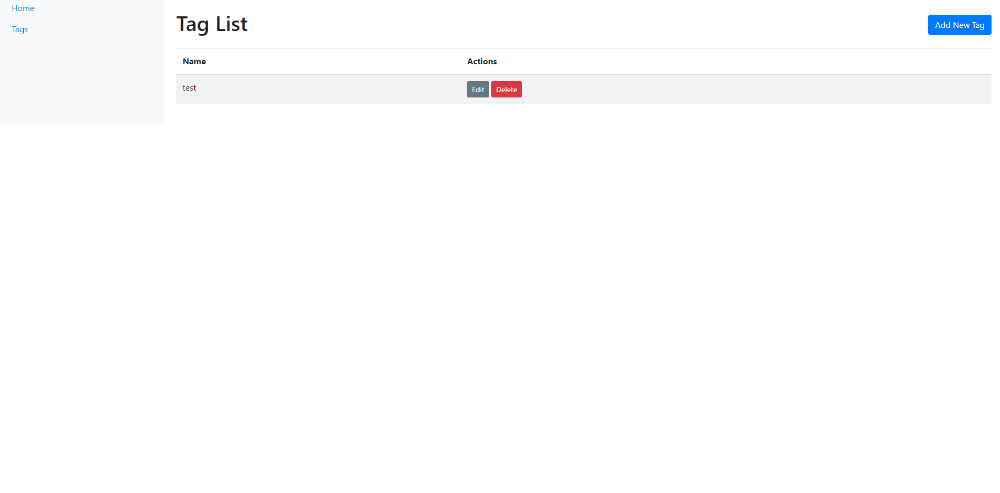
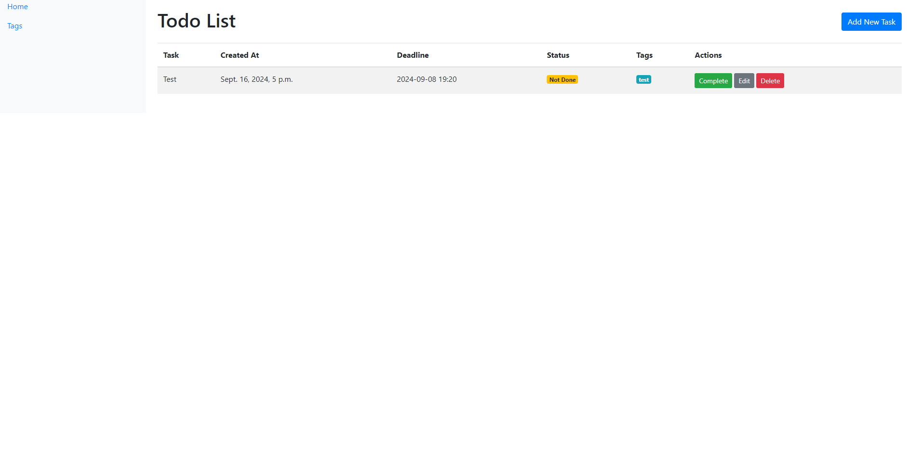

This is a Django-based todo list web application that allows users to manage tasks efficiently. The application provides a user-friendly interface to add, update, delete, and mark tasks as complete. Additionally, it supports task tagging, enabling users to categorize their tasks by themes.

## Features

- **Task Management:**
  - Add new tasks with content, creation datetime, and optional deadline.
  - Mark tasks as complete or undo the completion status.
  - Edit and delete tasks.
  - Tasks are displayed from newest to oldest, with incomplete tasks shown first.

- **Tagging:**
  - Assign multiple tags to tasks.
  - Manage tags (add, edit, and delete tags).
  - View all tags on a dedicated tag list page.

- **Responsive UI:**
  - Sidebar navigation for quick access to the home page and tag list page.
  - Bootstrap-styled interface for a modern look and feel.

## Installation

### Prerequisites
- Python 3.10+
- Django 5.1+
- Git

### Steps to Set Up the Project

1. Clone the repository:
   ```bash
   git clone https://github.com/your-username/todo-list-project.git
2. Run application:
   enter in code redactor
   ```bash
   python manage.py migrate
  ```bash
    python manage.py runserver
```

## Screenshots
### Todo list (main page)
In this photo we can see our's tasks. Also in this page are visible `Add new task` button, `Home` and `Tags` sidebar buttons. 

### Tag List page
Here we see our created tags, which in further steps we'll use for task creation in `Add New Task` page.(But tags isn`t mandatory for it, you should to create them for task understanding) 

### Add new task page
Finally we arrived to task creating. So we see `content field`, `deadline field`(you must set it in a `ISO 8601 date format` like `2024-09-08 19:20:00`):
- 2024 - year
- 09 - month
- 08 - day
- 19:20:00 - time

### Add new tag page
Nothing special, you just add new tag for task topic definition

### Created tag

### Created task

### Completed task
When you clicked `Complete` button, you pointed this task finished


